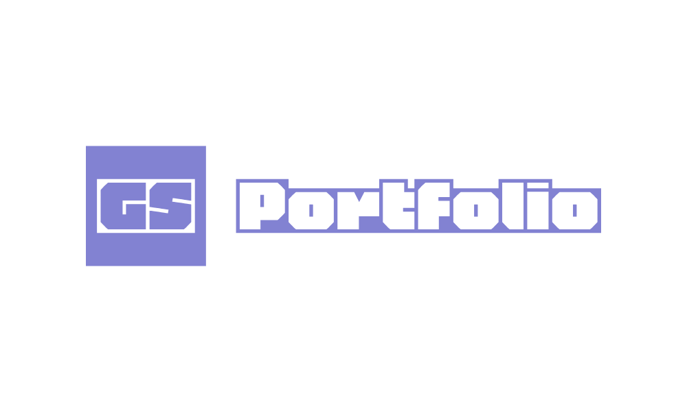
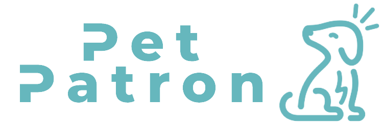

<!---

--->

<h1 align="center">Hallo 👋🏻 I'm Georgina Spieth</h1>
<h3 align="center">Junior Fullstack Developer 👩🏻‍💻 Java, Ruby on Rails, SQL, JavaScript, HTML, CSS
</h3>

 

Junior Fullstack Developer aspiring to work in backend as a Java dev! Experienced working on multiple website & database projects for several years from a strategic & project management point of view as a former campaign director and with a master's in Digital Entrepreneurship. My true passion is playing around with refactoring code to compare different approaches of applying logic. Excited to learn from experienced developers & use my product focused mindset!

 <ul>
 <li> ☕️ Currently solving Java Challenges, find my soultions on <a href="https://github.com/GGC0des/Exercism-Java?tab=readme-ov-file#readme" target="_blank"> Github </a> or <a href="https://exercism.org/profiles/GGC0des" target="_blank"> my Exercism profile </li> 
 <li> 🖥 Web App <a href="https://www.petpatron.help/" target="_blank"> PetPatron </li>
  <li> 👩🏻‍💻 About Me Page <a href="https://ggc0des.github.io/portfolio/" target="_blank"> here </li>

<h2 align="left">Connect with me:</h2>

 
   
   
   
 

<h3 align="left">Languages and Tools:</h3>

            

<!---
GGC0des/GGC0des is a ✨ special ✨ repository because its `README.md` (this file) appears on your GitHub profile.
You can click the Preview link to take a look at your changes.
--->
